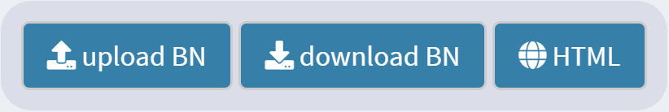
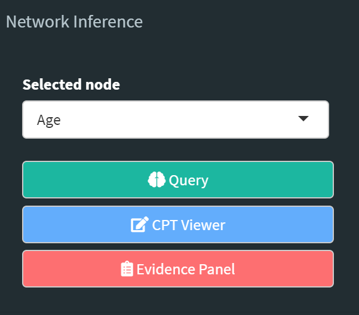

# ShinyDBNet Documentation

`shinyDBNet` is a Shiny application that provides an interactive framework for reasoning with **Discrete Bayesian Networks** (DBNs).

*Disclaimer* This documentation assumes that the reader is familiar with of Bayesian Networks. If not so, [here](https://machinelearningmastery.com/introduction-to-bayesian-belief-networks/) is a gentle introduction to the main concepts of Bayesian Networks, along with some further readings.

## Getting Started

You can run the app from [here](https://detsutut.shinyapps.io/shinyDBNet/) or from your local machine. Follow the instruction in [Development, Testing and Deployment](https://github.com/detsutut/shinyDBNet#development-testing-and-deployment) for the latter approach.

### Learning the Bayesian Network

In order to learn the DBN, two files must be uploaded. These files describes the network in terms of its nodes (i.e. variables), its edges (i.e. relationships between variables) and the data from which to learn the conditional probability tables (i.e. the dataset you're interested in learning from). The conditional probability tables (CPTs) are learnt using posterior Bayesian estimation arising from a flat, non-informative prior \[Nagarajan et al., 2013\].

  

Files have to be in \*.csv format and must follow this templates:

* Edges: the directed connections between the nodes of the network

  | from | to  |
  | ---- | --- |
  | Cloudy    | Sprikler   |
  | Cloudy    | Rain   |
  | Sprikler   | Wet Grass   |
  | Rain    | Wet Grass   |

* Data: the entries from which to learn the conditional probability tables (CPTs)

  | Cloudy | Sprikler | Rain | Wet Grass |
  | ------ | -------- | ---- | --------- |
  | Yes    | No       | Yes  | Yes       | 
  | No     | No       | No   | No        | 
  | No     | Yes      | No   | Yes       | 
  
**IMPORTANT: the names of the Edges entries and the names of the Data columns must coincide.**

### Loading and downloading the Bayesian Network

If you already learnt your DBN, you can also upload it directly into the app using the `upload BN` button from the panel on the top-right side. 
In the same way, the currently displayed DBN can be downloaded as an R object through the `download BN` button.

If you only want to share the visual representation of your DBN, without allowing any editing, you can use the `HTML` button to download the canvas as an HTML page. Right click and "save image as..." will do the trick if you want a PNG file instead.

  

If you don't have a pre-trained DBN to load and no data to learn from, you can play with a **pre-trained example** by clicking the `Load Example` button. This will upload a network for evaluating car insurance risks, which is detailedly described [here](https://www.bnlearn.com/documentation/man/insurance.html).

### Querying the Network

Click on the nodes to see their prior distributions, where you can also set the evidence for the target node. If multiple evidence has to be set, you may consider using the `Evidence Panel` to manage it quickly.

When you're done with the evidence setting, select the node you want to query and use the sidebar panel to perform the query and see how the distribution changes.

  

The metod used to perform this conditional probability queries it logic sampling, used to generate random samples conditional on the evidence. More information on logic sampling can be found [here](https://www.bnlearn.com/documentation/man/cpquery.html).

## Development, Testing and Deployment

WORK IN PROGRESS. 

## Example: the Asia dataset

Here we will learn a DBN from a small synthetic data set \[Lauritzen and Spiegelhalter, 1988\] about lung diseases (tuberculosis, lung cancer or bronchitis) and visits to Asia. This example can be found on Scutari's [bnlearn webpage](https://www.bnlearn.com/documentation/man/asia.html) too.

Lauritzen and Spiegelhalter (1988) motivate their work as follows:

“ *Shortness-of-breath (dyspnoea) may be due to tuberculosis, lung cancer or bronchitis, or none of them, or more than one of them. A recent visit to Asia increases the chances of tuberculosis, while smoking is known to be a risk factor for both lung cancer and bronchitis. The results of a single chest X-ray do not discriminate between lung cancer and tuberculosis, as neither does the presence or absence of dyspnoea.* ”

Standard learning algorithms are not able to recover the true structure of the network because of the presence of a node (E) with conditional probabilities equal to both 0 and 1. Monte Carlo tests seems to behave better than their parametric counterparts.

WORK IN PROGRESS.

## Built With

* [R](https://www.r-project.org/) - Main Language
* [SHINY](https://shiny.rstudio.com/) - Used to build the interactive web app straight from R
* [BNLEARN](https://www.bnlearn.com/) - Main depencency of the project, used to learn and query the bayesian network
* [VISNETWORK](https://datastorm-open.github.io/visNetwork/) - For network visualization
* [SHINYAPPS.IO](http://shinyapps.io/) - RStudio servers where the webapp is hosted

## FAQ

* **Why the posterior distribution of the queried node is zero?** *Logic sampling, the method currently implemented for conditional probability queries, is a form of rejection sampling. Therefore, only the obervations matching evidence (out of the n that are generated) are returned, and their number depends on the probability of evidence. If the evidence you set doesn't mach any of your observations, then the number generated samples will be zero.*
  
* **After setting the evidence, the distribution of the queried node don't change. Why?** *There are several scenarios in which this may happen. First, check that the distributions you are seeing come from the 'Query Results' panel and not from the `Node Details` one (where you can see only the prior distribution). If the panel you are checking is correct, then the variable(s) you set might not influence the target or your query, or their overall influence might be cancelled out by the single components.*

## Authors

* **Tommaso Buonocore** - *Author and Repository Maintainer* - [GitHub](https://github.com/detsutut), [LinkedIn](https://www.linkedin.com/in/tbuonocore/)

## License

This project is licensed under the LGPLv3 License - see the [LICENSE.md](LICENSE.md) file for details

