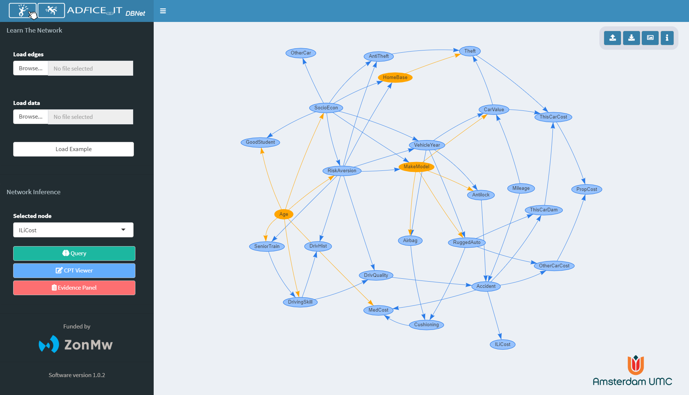
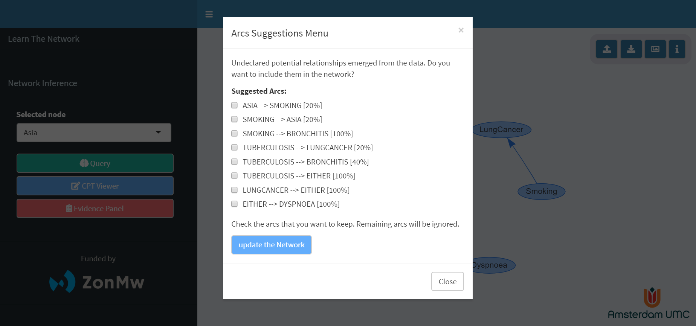
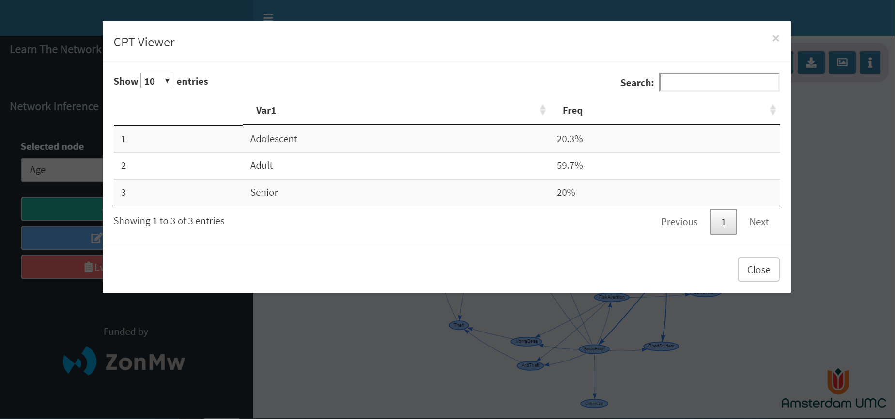
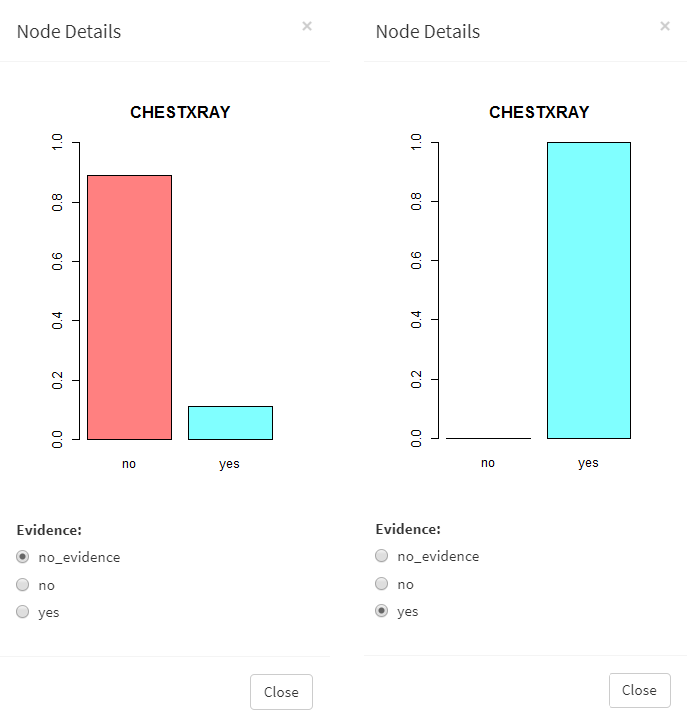
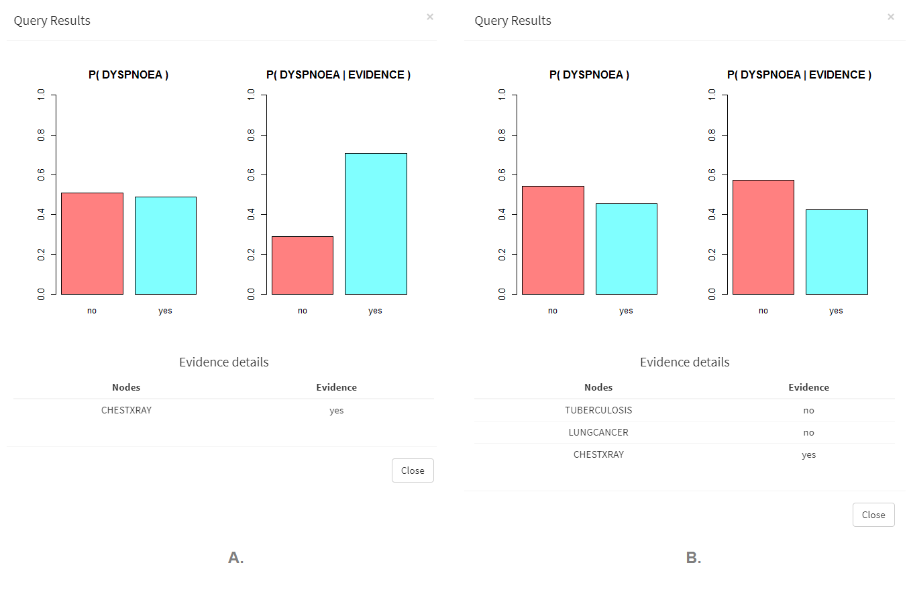
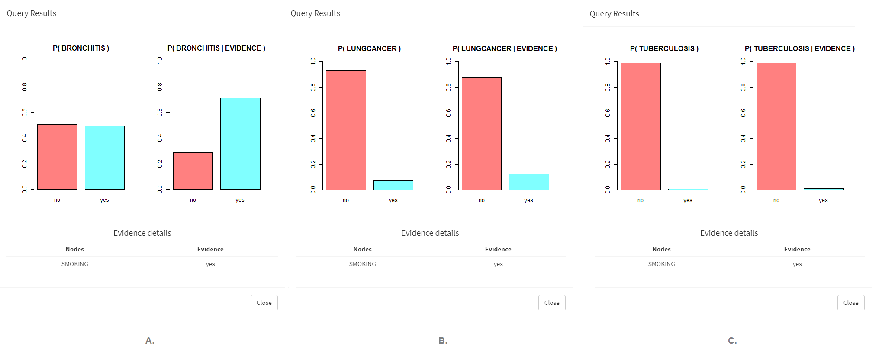

# ShinyDBNet Documentation

Originally developed whithin the UMC's ADFICE_IT project as an educational tool for fall-risk prevention in eldery patients, this open-source Shiny application evolved as a public, generic toolkit providing an **interactive framework for learning, visualizing and reasoning with Discrete Bayesian Networks** (DBNs). A DBN is a type of probabilistic graphical model that uses Bayesian inference for probability computations.

*This documentation assumes that the reader is already familiar with of Bayesian Networks. If not so, a gentle introduction to the main concepts of Bayesian Networks can be found [here](https://machinelearningmastery.com/introduction-to-bayesian-belief-networks/), along with some further readings.*

<p align="center">
  
  <p align ="center"><small>Application preview</small></p>
</p>

## Summary

1) [Getting Started](https://github.com/detsutut/shinyDBNet#getting-started)
    * [Running the App](https://github.com/detsutut/shinyDBNet/#running-the-app)
    * [Learning the Bayesian Network](https://github.com/detsutut/shinyDBNet/#learning-the-bayesian-network)
    * [Data-driven Arcs Suggestions](https://github.com/detsutut/shinyDBNet/#data-driven-arcs-suggestions)
    * [Loading the Bayesian Network](https://github.com/detsutut/shinyDBNet/#loading-and-downloading-the-bayesian-network)
    * [Querying the Network](https://github.com/detsutut/shinyDBNet/#querying-the-network)
    * [Conditional Probability Table](https://github.com/detsutut/shinyDBNet/#conditional-probability)
2) [Example: the Asia dataset](https://github.com/detsutut/shinyDBNet/#example-the-asia-dataset)
3) [Built With](https://github.com/detsutut/shinyDBNet/#built-with)
4) [FAQ](https://github.com/detsutut/shinyDBNet/#faq)
5) [Future Developments](https://github.com/detsutut/shinyDBNet/#future-developments)
6) [Authors](https://github.com/detsutut/shinyDBNet/#authors)
7) [Acknowledgements](https://github.com/detsutut/shinyDBNet/#acknowledgements)
8) [License](https://github.com/detsutut/shinyDBNet/#license)

## Getting Started

### Running the App

There are 3 ways to run `shinyDBNet` from your machine:

1) Remote run from RStudio's `shinyapps.io` server
    - [Clike here](https://detsutut.shinyapps.io/shinyDBNet/) to run the application
    - No need to download and install anything. Internet connection is required though.
    - Limited to 25 hours/month. Please use method 2) and 3) if applicable.
    
2) Local run directly from the GitHub repository
    - R/RStudio is required,
    - The app dependencies must be installed in your R environment. You can install the packages as follows:
      ```
       install.packages(c("shiny",
                          "shinyjs",
                          "shinydashboard",
                          "ggplot2",
                          "plotly",
                          "shinyBS",
                          "dplyr",
                          "visNetwork",
                          "bnlearn",
                          "gRain",
                          "pbapply",
                          "DT")) 
      ```
    - To run the app directly from the GitHub repository, enter the following command:
      ```
       shiny::runGitHub('shinyDBNet', 'detsutut')
      ```
  3) Clone the repository and run locally
      - This approach is recommended for those who want to modify/extend the app itself or just want to have a look at the code that powers the app
      - First, initialize the directory you want to use as the app container with `git init` (make sure you have Git installed)
      - Then, move into that directory and run the following command to clone the repository onto your local machine. This will get you a running copy of the most recent version of `shinyDBNet`.
        ```
         git clone https://github.com/detsutut/shinyDBNet.git
        ```
      - App dependencies must be installed as illustrated in 2. So open R (or R Studio) and make sure the packages are installed as in 2 above, and upload them (using library for each package).
      - Now you can run the app by typing the following line (note that the path to the app will end with "shinyDBNet", which is the directory that was created in the folder in which you performed the `git clone` command above):
        ```
         shiny::runApp("your/path/to/the/app/directory")
        ```
    
### Learning the Bayesian Network

In order to learn the DBN, two files must be uploaded. These files describes the network in terms of its nodes (i.e. variables), its edges (i.e. relationships between variables) and the data from which to learn the conditional probability tables (i.e. the dataset you're interested in learning from). The conditional probability tables (CPTs) are learnt using posterior Bayesian estimation arising from a flat, non-informative prior \[Nagarajan et al., 2013\].

<p align="center">
  
  <p align ="center"><small>Network Learning Panel</small></p>
</p>

Files have to be in \*.csv format and must follow this templates:

* Edges: the directed connections between the nodes of the network

  | from | to  |
  | ---- | --- |
  | Cloudy    | Sprikler   |
  | Cloudy    | Rain   |
  | Sprikler   | Wet Grass   |
  | Rain    | Wet Grass   |

* Data: the entries from which to learn the conditional probability tables (CPTs)

  | Cloudy | Sprikler | Rain | Wet Grass |
  | ------ | -------- | ---- | --------- |
  | Yes    | No       | Yes  | Yes       | 
  | No     | No       | No   | No        | 
  | No     | Yes      | No   | Yes       | 

Important notes about the input files:

- **the entries in the Edges file and the columns in the Data file must have the same names** (see example above)
- **missing values are not handled correctly**. Please impute/remove the missing values before submitting the data. 

### Data-driven Arcs Suggestions

When the DBN is created from the data, the app may suggest some additional connections that were absent in the user-defined DAG but have emerged from data-driven structure learning. The square brackets show the strength of the proposed arcs, i.e. proportion of times an arc have been discovered among the bootstrapped structures.

<p align="center">
  
  <p align ="center"><small>Arcs Suggestion Panel</small></p>
</p>

### Loading and downloading the Bayesian Network

If you already learnt your DBN, you can also upload it directly into the app using the `upload` button from the panel on the top-right side. 
In the same way, the currently displayed DBN can be downloaded as an R object through the `download` button.

If you only want to share the visual representation of your DBN, without allowing any editing, you can use the `picture` button to download the canvas as an HTML page. Right click and "save image as..." will do the trick if you want a PNG file instead.

<p align="center">
  
  <p align ="center"><small>Download/Upload Panel</small></p>
</p>

If you don't have a pre-trained DBN to load and no data to learn from, you can play with a **pre-trained example** by clicking the `Load Example` button. This will upload a network for evaluating car insurance risks, which is detailedly described [here](https://www.bnlearn.com/documentation/man/insurance.html).

### Querying the Network

Double click on the nodes to see their prior distributions, where you can also set the evidence for the node. If multiple evidence has to be set, you may consider using the `Evidence Panel` to manage evidence setting quickly.

When you're done with the evidence setting, select the node you want to query and use the sidebar panel to perform the query and see how the distribution changes.

<p align="center">
  
  <p align ="center"><small>Query Panel</small></p>
</p>

The metod used to perform this conditional probability query is logic sampling, which is used to generate random samples conditional on the evidence. More information on logic sampling can be found [here](https://www.bnlearn.com/documentation/man/cpquery.html).

### Conditional Probability Tables

The conditional probability tables of each node of the network can be viewed through the `CPT Viewer` button. Conditional probability tables are read-only at the moment.

<p align="center">
  
  <p align ="center"><small>CPT Viewer</small></p>
</p>

## Example: the Asia dataset

Here we will learn a DBN from a small synthetic data set \[Lauritzen and Spiegelhalter, 1988\] about lung diseases (tuberculosis, lung cancer or bronchitis) and visits to Asia. This example can be found on Scutari's [bnlearn webpage](https://www.bnlearn.com/documentation/man/asia.html) too.

Lauritzen and Spiegelhalter (1988) describe it as follows:

“*Shortness-of-breath (dyspnoea) may be due to tuberculosis, lung cancer or bronchitis, or none of them, or more than one of them. A recent visit to Asia increases the chances of tuberculosis, while smoking is known to be a risk factor for both lung cancer and bronchitis. The results of a single chest X-ray do not discriminate between lung cancer and tuberculosis, as neither does the presence or absence of dyspnoea.*”

<p align="center">
  
  <p align ="center"><small>Directed Acyclig Graph (DAG) representation of Lauritzen and Spiegelhalter problem</small></p>
</p>

We might then be interested in answering some questions about how these variables interact with eachother, as for instance:
* How does knowing that the subject took a `ChestXRay` scan in the last year influences our guessing on `Dyspnoea`?
* How do the chances of having `Dyspnoea` change if we also know that the patient has neither `Tubercolosis` nor `Lung Cancer`?
* How does smoking affect the probabilities of having a `Lung Cancer` or `Bronchitis`? Does it affect `Tubercolosis` as well?

In order to anser these questions, we must learn the Discrete Bayesian Network. Thus, the two files mentioned in [Learning the Bayesian Network](https://github.com/detsutut/shinyDBNet/#learning-the-bayesian-network) must be loaded first (you can find them in the data folder).

Once the network is learnt and rendered, we can use inference using our model to answer the previous questions. Let's first set `ChestXRay = YES` by clicking on the node and checking the radio button.

<p align="center">
  
  <p align ="center"><small>Setting the evidence on the ChestXRay node</small></p>
</p>

After setting the evidence on the observed node, we can perform a conditional probability query on the node of interest, in this case `Dyspnoea`.

<p align="center">
  
  <p align ="center"><small>Conditional probability query on Dyspnoea</small></p>
</p>

As shown in the figure above (A.), we can assess that knowing a patient has undergone a chest X-ray scan increases the probability of having dyspnoea. 

Querying other nodes of the network under the same evidence set, we can clearly see that the reason of this increment is due to the association between `ChestXRay`, `LungCancer` and `Tubercolosis`: if a patient undergoes a chest X-ray, chances are that he's doing it because he has `Tubercolosis` or `LungCancer`, which have a direct influence on the `Dyspnoea` value.

Setting a negative evidence on both the `Tubercolosis` and the `LungCancer` nodes (B.) therefore "cancels out" the effect of `ChestXRay` restoring a distribution very close to the prior distribution. Recall that you can use the `Evidence Menu` to set the evidence on multiple nodes quickly.

Let's see how being a smoker influences `Lung Cancer`, `Bronchitis`, and `Tubercolosis`.

<p align="center">
  
  <p align ="center"><small>Conditional probability query on Bronchitis (A.), Lung Cancer (B.) and Tubercolosis (C.)</small></p>
</p>

In all the three queries, being a smoker increases the chances of having the desease, but with different magnitudes.

## Built With

* [R](https://www.r-project.org/) - Main Language
* [SHINY](https://shiny.rstudio.com/) - Used to build the interactive web app straight from R
* [BNLEARN](https://www.bnlearn.com/) - Main depencency of the project, used to learn and query the bayesian network
* [VISNETWORK](https://datastorm-open.github.io/visNetwork/) - For network visualization
* [SHINYAPPS.IO](http://shinyapps.io/) - RStudio servers where the webapp is hosted

## FAQ

* **Why the posterior distribution of the queried node is zero?** *Logic sampling, the method currently implemented for conditional probability queries, is a form of rejection sampling. Therefore, only the obervations matching evidence (out of the n that are generated) are returned, and their number depends on the probability of evidence. If the evidence you set doesn't mach any of your observations, then the number of generated samples will be zero.*
  
* **After setting the evidence, the distribution of the queried node doesn't change. Why?** *There are several scenarios in which this may happen. First, check that the distributions you are seeing come from the `Query Results` panel and not from the `Node Details` one (where you can only see the prior distributions). If the panel you are checking is correct, then the variable(s) you set might not influence the target or your query, or their overall influence might be cancelled out by the single components. Check the [example](https://github.com/detsutut/shinyDBNet#example-the-asia-dataset) to see how it happens.*

* **Querying the same node multiple times, under the same evidence set, gives me different distributions. Why?** *Queries are performed using approximate inference methods based on Monte-Carlo Particle Filters. Some variability in the results is threfore expected since they are Monte Carlo estimates. If the variability in the results is too high, then your evidence is likely to have a very low probability (i.e. very complex query) and you need to generate more particles to obtain a reasonably precise estimate of that conditional probability. Unfortunately, the number of particles to generate is not user-defined at the moment.*

## Future Developments

* CPTs edit
* Support for latent variables
* Support for missing values
* Use exact inference on relatively simple networks
* Nodes and arcs interactive add/removal
* Allow DAG import from DAGitty
* Detect cycles in the DAGs and propose possible trimmings to address the problem

See the [changelog](https://github.com/detsutut/shinyDBNet/blob/master/CHANGELOG.md) file to follow the chronological development of the application.

## Authors

* **Tommaso Buonocore** - *Author and Repository Maintainer* - [GitHub](https://github.com/detsutut), [LinkedIn](https://www.linkedin.com/in/tbuonocore/)

## Acknowledgements

We thank [ZonMw](https://www.zonmw.nl/nl/) for funding this project as part of the ADFICE-IT research project. The work has been supervised by Prof. [Ameen Abu-Hanna](https://kik.amc.nl/home/aabuhanna/) and Prof. Nathalie van der Velde from, respectively, the departments of Medical Informatics and Geriatrics of the Amsterdam [UMC](https://www.amsterdamumc.nl/), location AMC. Thanks are also due to the whole ADFICE-IT team.

<table width="100%" border="0" style="border-color: white;">
  <tr>    
  <td width="33%"></td>
  <td width="33%"></td>
  <td width="33%"></td>
  </tr>
</table>

## License

This project is licensed under the AGPLv3 License - see the [LICENSE.md](LICENSE.md) file for details

<p align="center">
  
</p>
